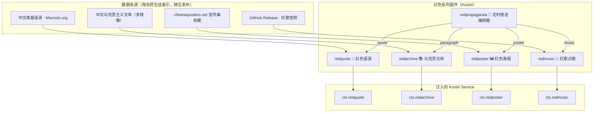

# 🔴 koishi-plugin-socialism

> **Koishi「红色系列」插件生态** · 语录 · 文库 · 海报 · 红歌 · 定时宣传
> 单仓多包（pnpm workspace）· TypeScript · MIT License

<div align="center">

[](https://www.npmjs.com/package/koishi-plugin-redquote)
[](https://www.npmjs.com/package/koishi-plugin-redarchive)
[](https://www.npmjs.com/package/koishi-plugin-redposter)
[](https://www.npmjs.com/package/koishi-plugin-redmusic)
[](https://www.npmjs.com/package/koishi-plugin-redpropaganda)

[](LICENSE)
[](package.json)

</div>

---

## 🎯 这是什么

一套以「红色文化」为主题、面向 [Koishi](https://koishi.chat) 机器人的**插件生态**。它不是一个插件，而是**五个可自由组合的插件**——各自独立可用，又通过 Koishi 的 Service 机制深度互操作：

- 📜 **redquote** — 革命导师经典语录（1200+ 条，零网络依赖）
- 📚 **redarchive** — 中文马克思主义文库全文抓取（多镜像容灾）
- 🖼️ **redposter** — 中国社会主义宣传画海报库（4000+ 张）
- 🎵 **redmusic** — 红歌点歌台（69 首，已获授权）
- 📣 **redpropaganda** — 定时宣传推送编排器（把前四个组合成自动化任务）

所有插件遵循同一套设计语言：**统一命令前缀、统一的 Service API（`random` / `pick` / `list` / `send`）、统一的缓存约定、统一的多语言文档**。装上任意一个即可点歌/刷语录，装齐一套即可搭建「早八点自动推送语录 + 海报」的完整自动化宣传机器人。

## 🏗️ 生态架构



## ✨ 设计亮点

| # | 亮点 | 说明 |
|---|------|------|
| 1 | **Service 优先** | 每个插件注入可编程服务，命令只是薄壳。其他插件可用 `ctx.redquote.random()` 一行集成语录能力 |
| 2 | **索引随包，资产按需** | 元数据索引随 npm 包发布（KB 级、零网络）；大资产（音频/海报图）首次使用时按需下载到本地缓存 |
| 3 | **缓存分级** | `data/redseries/` 存不可再生资产（音频、海报图），`cache/redseries/` 存可再生缓存（文库文档），删除即重建 |
| 4 | **内容合规** | 双层敏感过滤：爬虫层剔除红线内容 + 运行时 `filterSensitive` 开关，兼顾可用性与平台安全 |
| 5 | **多语言文档** | 插件内嵌 `usage` 文档支持 🇨🇳 中 / 🇬🇧 英 / 🇷🇺 俄 三语切换 |
| 6 | **纯 HTTP 抓取** | 文库/语录/海报爬虫全部基于 Node HTTP + cheerio，无需 Playwright，低资源占用 |

## 📦 包一览

| 包 | 一句话简介 | 主要内容 | 网络依赖 |
|----|-----------|---------|---------|
| [redquote](./packages/redquote) | 革命导师经典语录 | 1200+ 条 · 6 位人物 · 中英双语 | 🚫 零网络 |
| [redarchive](./packages/redarchive) | 马克思主义文库全文抓取 | 多镜像容灾 · HTML 清洗为 Markdown · 自动编码检测 | ⚡ 按需 |
| [redposter](./packages/redposter) | 中国宣传画海报库 | 近 300 主题 · 4400+ 海报 · 中英文/年份检索 | ⚡ 按需 |
| [redmusic](./packages/redmusic) | 红歌点歌台 | 69 首 · 12 类标签 · 已获授权 | 📦 首次下载 |
| [redpropaganda](./packages/redpropaganda) | 定时宣传推送编排器 | cron 定时 · 4 种内容源 · 多任务多群 | 🔌 依赖前者 |

## 🚀 快速开始

每个插件都是独立的 Koishi 插件，在 [Koishi 控制台](https://koishi.chat/zh-CN/manual/console/market.html) 插件市场中搜索安装即可：

```
# 想要语录？
npm i koishi-plugin-redquote

# 想要一张海报？
npm i koishi-plugin-redposter

# 想红歌？
npm i koishi-plugin-redmusic

# 想宣传？
npm i koishi-plugin-redpropaganda koishi-plugin-cron-fix
```

> 💡 `redpropaganda` 是「编排器」，本身不含内容，需要同时安装至少一个内容插件（`redquote` / `redarchive` / `redposter` / `redmusic`），未安装的来源会自动跳过。

## 📖 各包详情

### 📜 redquote · 红色语录

收录马克思、恩格斯、列宁、毛泽东、切·格瓦拉、斯大林 6 位人物的 1200+ 条中英双语语录，索引随包发布，**运行时零网络依赖**。

| 命令 | 说明 |
|------|------|
| `红色语录 [作者] [数量]` | 随机语录，可按作者（`红色语录 毛泽东`）与数量（`红色语录 3`）筛选 |
| `红色语录列表` | 查看所有作者及语录数量 |

```text
红色语录            # 随机一条
红色语录 列宁 2      # 列宁语录 ×2
```

**服务 API**：`random(filter)` / `pick(n, filter)` / `list(filter)` / `authors()` / `format(quote)` / `send(session, filter)`

📖 [完整文档 →](./packages/redquote/readme.md)

### 📚 redarchive · 马克思文库

抓取[中文马克思主义文库](https://www.marxists.org/chinese/)全文，纯 HTTP 实现；自动识别 GB2312/GBK/UTF-8 编码，将上古 HTML 页面**清洗为干净的 Markdown 文件**发送，支持多镜像入口按优先级容灾。

| 命令 | 说明 |
|------|------|
| `马克思` / `marxists` | 交互式选择分类与文档，获取下载附件 |
| `马克思段落` | 随机从文库文档中抽取一段话（含出处） |

**服务 API**：`listCategories()` / `listDocuments(url)` / `getMarkdown(url)` / `randomParagraph()` / `send(session)`

📖 [完整文档 →](./packages/redarchive/readme.md)

### 🖼️ redposter · 红色海报

基于 [chineseposters.net](https://chineseposters.net/)（Stefan Landsberger 的收藏）构建的宣传画海报库。索引随包发布，海报图按需下载缓存，**不热链源站**。支持中文别名、英文主题、年份等多维检索。

| 命令 | 说明 |
|------|------|
| `红色海报 [关键词]` | 随机海报，或按主题/关键词筛选 |
| `红色海报列表 [关键词]` | 查看主题及海报数量 |
| `红色海报重载` | 清空图片缓存（需 2 级权限） |

```text
红色海报            # 完全随机
红色海报 大跃进      # 中文别名
红色海报 1958       # 按年份
```

**服务 API**：`random(filter)` / `pick(filter)` / `list(filter)` / `themes(keyword)` / `send(session, filter)`

📖 [完整文档 →](./packages/redposter/readme.md)

### 🎵 redmusic · 红歌点歌

内置 69 首红歌（`.ogg`），涵盖纯曲、交响乐、电音、军乐、阅兵版等 12 类标签，**所有歌曲均已获得「小市民红球」授权**。约 110MB 音频托管于 GitHub Release，首次启动自动下载。

| 命令 | 说明 |
|------|------|
| `红歌 [歌名]` | 随机点歌，或指定歌名 / `/` 前缀筛选标签 |
| `红歌列表` | 查看所有可用红歌 |
| `红歌重载` | 重新下载音频资源（需 2 级权限） |

```text
红歌               # 完全随机
红歌 国际歌         # 指定歌名
红歌 /纯曲 /交响乐   # 多标签筛选
```

**服务 API**：`random(probability?, filter?)` / `pick(filter)` / `list(filter?)` / `send(session, probability?, filter?)`

📖 [完整文档 →](./packages/redmusic/readme.md)

### 📣 redpropaganda · 定时宣传推送

通过 cron 表达式定时向目标群推送红色内容，是整套生态的「编排器」。内容全部来自其他四个插件，支持多任务、多群、多来源组合。

```jsonc
// 配置示例：每天 8:00 推送 2 条语录 + 1 张海报
{
  "jobs": [{
    "cron": "0 8 * * *",
    "sources": [
      { "type": "quote", "count": 2 },
      { "type": "poster", "count": 1 }
    ],
    "targets": ["onebot:123456"]
  }]
}
```

| 命令 | 说明 |
|------|------|
| `红宣传推送 [任务序号]` | 立即手动推送（缺省推送全部任务） |
| `红宣传推送列表` | 查看已配置的定时任务 |

> 依赖 `koishi-plugin-cron-fix` 提供的 `cron` 服务，使用标准 5 段 cron 表达式（分 时 日 月 周）。

📖 [完整文档 →](./packages/redpropaganda/readme.md)

## 🧠 架构决策

### 为什么是 monorepo？

五个插件共享同一套设计规范（服务 API 风格、缓存约定、爬虫工具链、编码风格），却各自独立发布、独立安装。单仓多包让它们**共演进而不共生命周期**——你可以只装语录，也可以全家桶。

### 缓存分级约定

```
data/redseries/    ← 不可/半可再生资产（删除即丢失，需重新下载）
  ├── redmusic/    红歌音频
  └── redposter/   海报原图
cache/redseries/   ← 纯可再生缓存（删除后自动重建）
  └── redarchive/  文库文档 KV
```

### 内容合规与版权

- 🎵 红歌音频：**小市民红球** 授权使用
- 🖼️ 海报索引：爬取自 chineseposters.net（遵循 robots.txt，限并发、带 UA、请求间隔），原图按需下载不热链
- 🛡️ 敏感过滤：爬虫层剔除红线主题（索引层面，不可绕过）+ 运行时 `filterSensitive` 开关（默认开启，可在配置中关闭）

## 🤝 交流与反馈

遇到问题或有建议？欢迎加入 QQ 群 **[1071284605【晓基地插件工坊】](https://qm.qq.com/q/WngX4RQoca)** 进行交流。

## 🛠️ 开发

```bash
pnpm install       # 安装依赖（pnpm 10）
pnpm build         # 构建全部包（tsup / tsc -b）
pnpm dev           # 并行 watch 模式
pnpm test          # 运行测试
```

- 代码规范：Biome（4 空格缩进、双引号、trailing commas）
- 版本管理：各包独立版本号，由仓库所有者手动管理

## 📄 许可证

[MIT](./LICENSE) © 2026 睦
